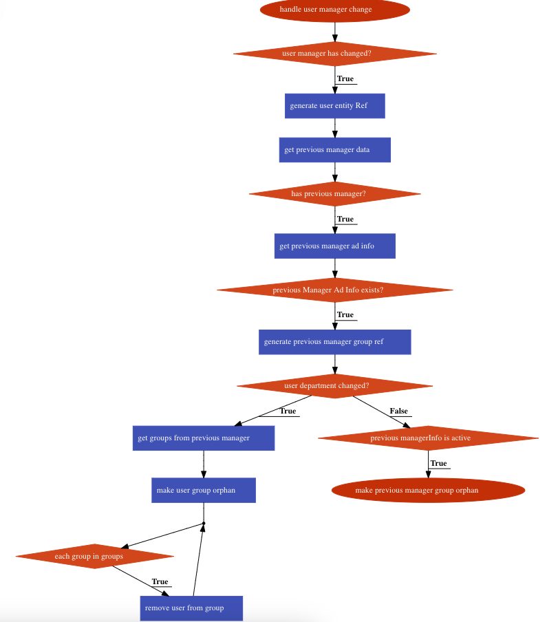

# Manager Group and User Management Changes

## Data: 05/07/2024

Registro de decisão de alteração na estrutura de gerenciamento de grupos e usuários.

- **Status**: Implantado.

- **Issue**: A decisão de permitir que managers dividam seu nó/grupo em múltiplos e de implementar mecanismos automáticos para remover usuários de grupos e transformar grupos em órfãos surgiu da necessidade de manter o catálogo do Backstage atualizado e vivo. Especificamente, precisamos assegurar que as mudanças na organização, como a alteração de managers ou a saída de funcionários, sejam refletidas de maneira precisa e automática no sistema de gerenciamento de grupos.

### Pontos Chaves da Mudança:
1. **Divisão de Grupos por Managers:**
   - A mudança permite que managers dividam o seu nó/grupo em múltiplos, proporcionando maior flexibilidade na organização e gestão dos times.

2. **Remoção Automática de Usuários de Grupos:**
   - Quando um manager é alterado, os usuários são automaticamente removidos dos grupos associados ao manager anterior, garantindo que a estrutura organizacional reflita sempre a realidade atual.

3. **Transformação Automática de Grupos em Órfãos:**
   - Caso um manager saia da organização ou mude de posição, seus grupos são automaticamente transformados em órfãos, prevenindo que grupos obsoletos permaneçam no sistema.

4. **Manutenção do Catálogo Vivo:**
   - Essas mudanças visam manter o catálogo vivo e atualizado, refletindo com precisão as mudanças organizacionais e prevenindo dados desatualizados.

### Implementação da Mudança:



```typescript
export async function handleManagerChange(database: Database, previousContent: any, newContent: any) {
  if (!managerChanged(previousContent.content, newContent)) {
    return;
  }

  const userEntityRef = EntityRef.fromEmail(newContent.id, 'user').toString();
  const previousManager = getManagerEmail(previousContent.content);

  if (!previousManager) {
    return;
  }

  const previousManagerInfo = await database.microsoftAD().get(previousManager);
  if (!previousManagerInfo) {
    return;
  }

  const previousManagerGroupRef = EntityRef.fromEmail(previousManager, 'group').toString();

  if (departmentChanged(previousContent.content, newContent)) {

    const groups = await database.additionalInformationRepository().get(previousManagerGroupRef);
    await Promise.all(groups.map(async (group) =>
      database.members().removeFromGroup(userEntityRef, group.id)
    ));

  } else if (previousManagerInfo?.content?.active) {
    // manager still active, meaning that the user was moved to another team or position
    await database.additionalInformationRepository().makeItOrphan(previousManagerGroupRef);
  }
}
```

### Decisão:
- **Decisão**: Optamos por implementar essa funcionalidade para garantir que o catálogo do Backstage esteja sempre atualizado com a estrutura organizacional vigente, prevenindo dados desatualizados e facilitando a gestão de grupos por managers.

### Motivo da Decisão:
- **Motivo**: Essa abordagem assegura que as mudanças na organização sejam refletidas de maneira automática e precisa no sistema, mantendo o catálogo atualizado e útil para os usuários.

### Documentação:
Para realizar essas adaptações, seguimos as recomendações [desta documentação](https://backstage.io/docs/overview/architecture-overview#group-management).