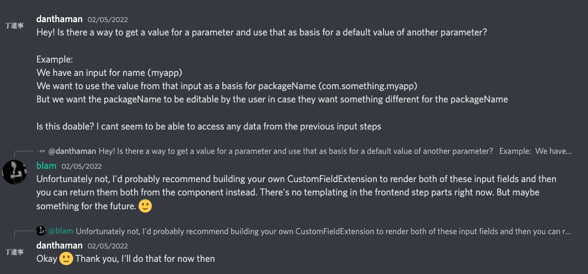

# Utilizando CustomFieldExtension como Combo para Owners, BU's e Cluster

Data: 14/10/2022

## Motivação

### Filtro por Entity Type

Foi levantado a possibilidade de filtrar o campo EntityPicker por `spec.type`. Após pesquisas na comunidade, encontramos um único [Pull Request](https://github.com/backstage/backstage/pull/7589) onde foi feita a tentativa de incluir o filtro, porém o mesmo foi fechado sem implantação. Sendo assim, foi feito um _fork_ do EntityPicker incluindo este filtro para uso no Moonlight.

Backstage não disponibiliza essa opção como padrão, [recomendando utilizarmos um CustomFieldExtension](https://discord.com/channels/687207715902193673/923143744176418836/970646373298995260)

