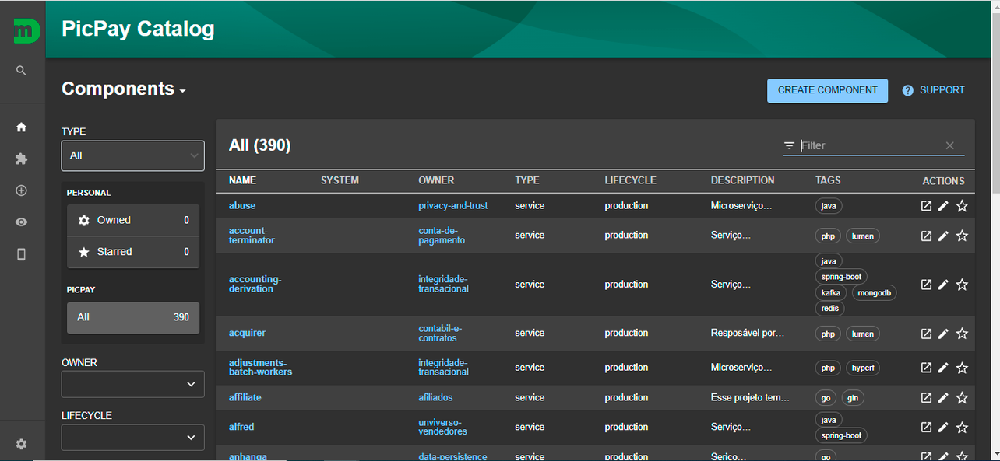
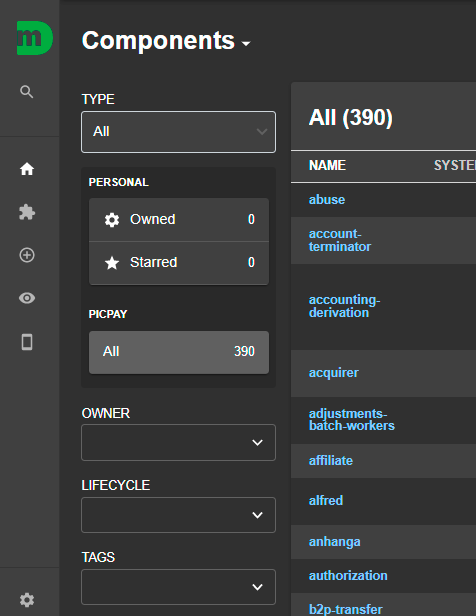

# Como acessar o Catálogo

Ao acessar a plataforma, é apresentado na página inicial o catálogo de componentes.

_Tela do Catálogo de Componentes_

É possível realizar filtros utilizando a barra lateral direita:

- Type: Filtra o tipo de componente;
- Personal:
  - Owned: Traz a quantidade de componentes atribuídos ao usuário logado;
  - Starred: Traz a quantidade de componentes marcados com estrela pelo usuário logado;
  - PicPay: Traz a quantidade de componentes na organização;
  - Owner: Filtra pelo dono do componente;
  - Lifecycle: Filtra pelo lifecycle;
  - Tags: Filtra pelas tags do componente.

_Barra lateral com os filtros disponíveis no Catálogo de Componentes_

É possível realizar busca por componentes, utilizando o campo busca à esquerda.

_Campo de busca_
