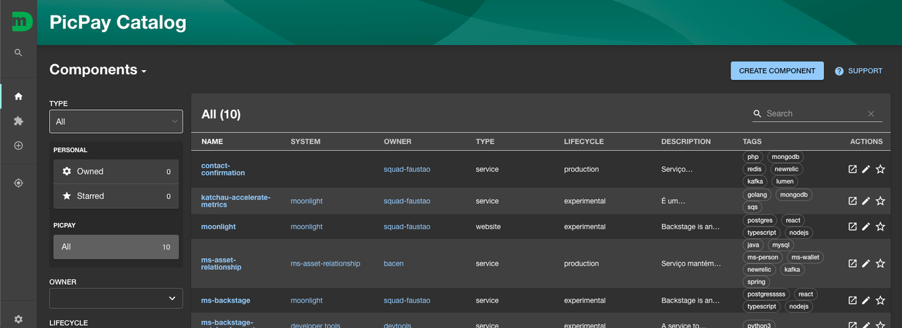

# Catálogo de Componentes

O Catálogo de Serviços substitui o antigo Teste de DNA, com ele é possível visualizar as informações dos microsserviços do PicPay. Como por exemplo o nome, equipe responsável, descrição do microsserviço entre outras informações.

## O que são as informações presentes no catálogo?

- **NOME**: nome do microsserviço;
- **SYSTEM**: agrupamento de componentes, que possuem um propósito similar. ( por padrão, o campo vem em branco e não está sendo usado atualmente);
- **OWNER**: time responsável pelo componente; [veja mais aqui](../gerenciar-equipes/index.md)
- **TYPE**: tipo de componente:
  - `service`: quando for um serviço;
  - `website`: pode ser usado quando for um frontend;
  - `lib`: quando for uma lib desenvolvida internamente;
  - `script`: quando for um script .`
- **LIFECYCLE**: estágio em que o componente se encontra:
  - `experimental`: quando o componente é uma POC e não está sendo usado em nenhum fluxo em abiente produtivo;
  - `development`: quando o componente se encontra somente em ambiente de desenvolvimento;
  - `qa`: quando o componente se encontra somente no ambiente de qa;
  - `qa-production`: quando o componente se encontra somente no ambiente qa production;
  - `production`: quando esse componente já está em produção;
- **DESCRIPTION**: descrição do componente;
- **TAGS**: etiquetas de palavras chaves, pertinente ao componente.

