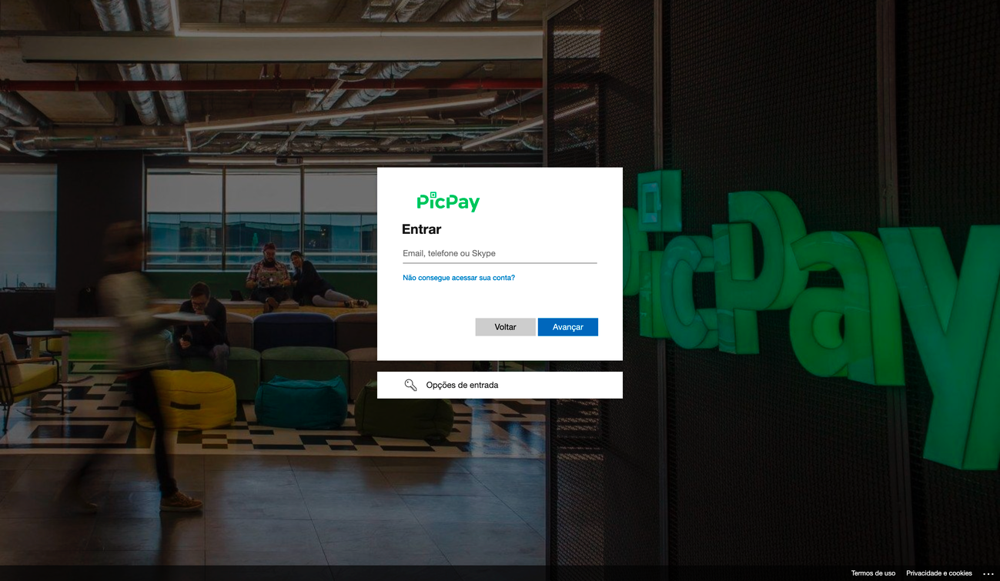
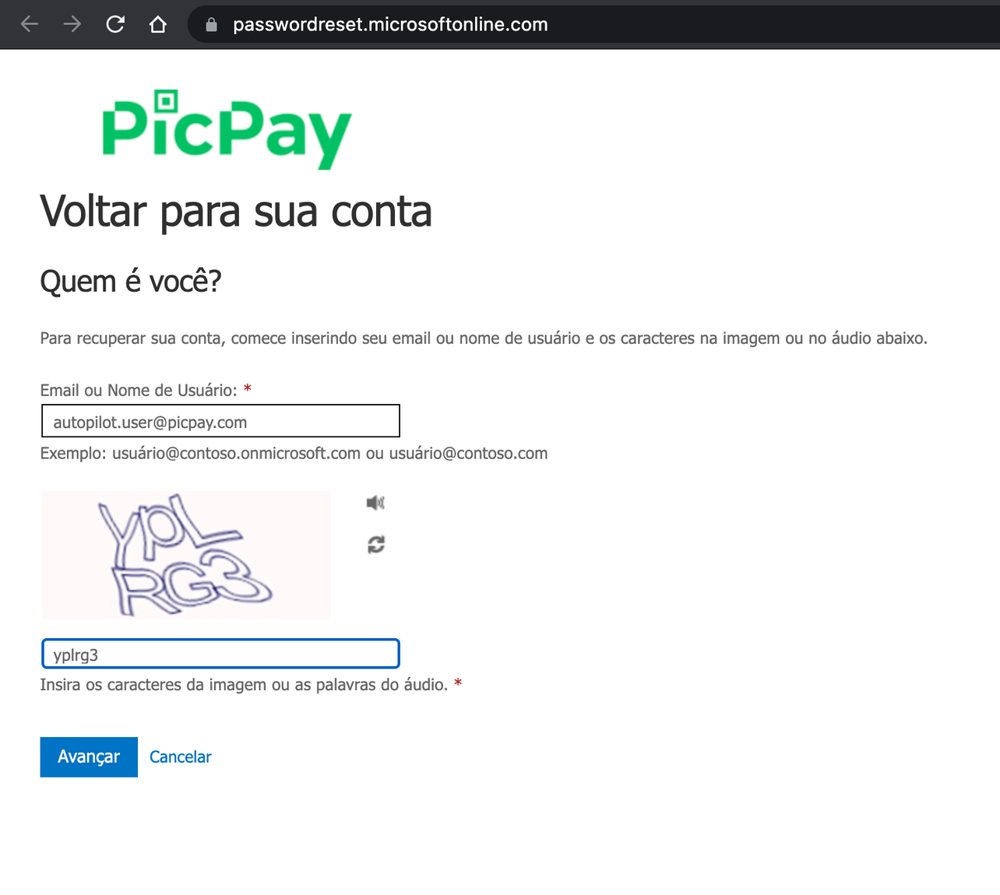
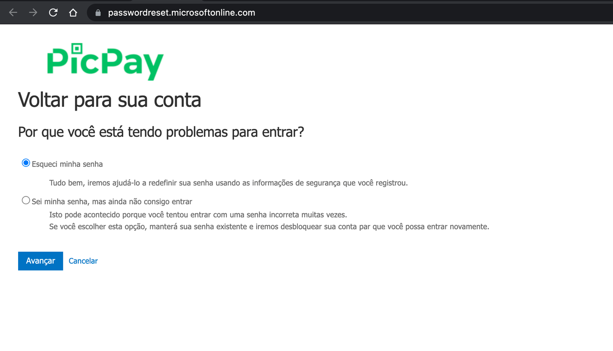
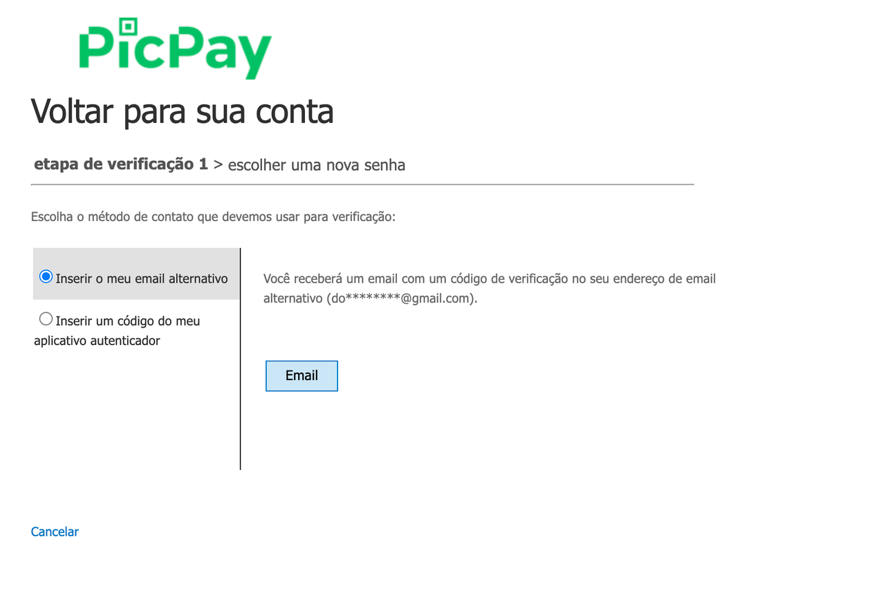
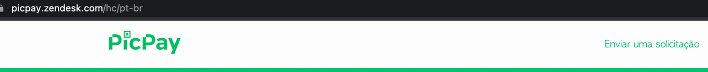
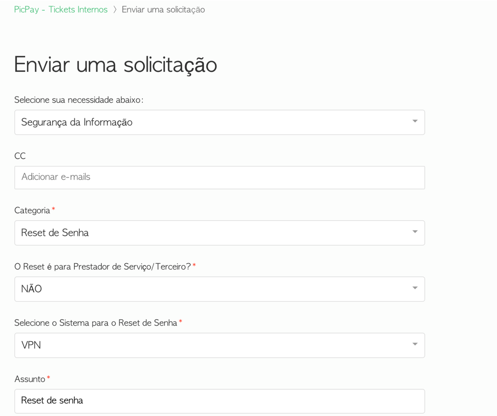

# Como acessar

O acesso ao Moonlight é feito pelo link https://moonlight.limbo.work/, para efetuar o login é preciso informar o e-mail e senha da conta Microsoft utilizada no PicPay, caso não esteja sincronizada.

> **Aviso**
>
> Devido um bug nos componentes do core do Backstage, o Moonlight não renderiza nos navegadores Safari. Utilize outro navegador para acessar o ambiente.

> **Informação**
>
> Não é necessário conectar à VPN para acessar o Moonlight. A plataforma utiliza o login do AD para autenticação.

Tela de login da Microsoft

## Esqueci o login de acesso ao AD, e agora?

A recuperação de senha é realizada no ambiente da Microsoft, para isso:

**Etapa 1**: acesse o ambiente da [Microsoft](https://passwordreset.microsoftonline.com/), preencha o e-mail e clique em avançar;

**Etapa 2**: escolha a opção esqueci minha senha e clique em avançar.

**Etapa 3**: escolha uma das opções para envio do código de autenticação:

- Inserir o meu email alternativo
- Inserir um código do meu aplicativo autenticador.
  

**Etapa 4**: digite o código de verificação enviado para o e-mail ou aplicativo autenticador e altere a senha.

## Abrir chamado no Zendesk

Caso não consiga alterar a senha, é necessário abrir um chamado no [Zendesk](https://picpay.zendesk.com/hc/pt-br/requests/new).

**Etapa 1**: faça login na ferramenta e clique em **enviar uma solicitação**.

**Etapa 2**: preencha os campos da seguinte forma:

- **Necessidade**: Segurança da Informação;
- **Categoria**: Gestão de Acessos / Reset de senha;
- **Selecione o sistema para reset de senha**: VPN;
- **Assunto**: Reset de senha VPN.

