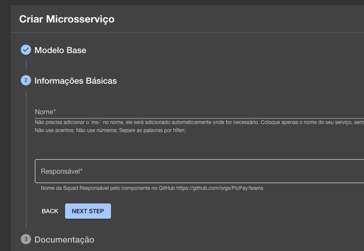

# Dúvidas frequentes

!!! info "Caso alguma aplicação não apareça no menu Components, pode significar que faltam alguns arquivos no repositório, que possibilitam a visibilidade na plataforma Moonlight."

??? faq "Como editar um microsserviço?"
Ao nomear um ms de forma incorreta, você pode arquivá-lo manualmente ou apenas desconsiderar e criar um novo. As demais edições, como descrição, link do board do jira, docs do Confluenc, você poderá editar diretamente no arquivo catalog-info.yaml.

??? faq "Para que serve o menu API’s?"
O menu API’s listará todos os serviços cujo qual contém a responsabilidade de fornecer informações para outras aplicações do PicPay, possibilitando assim que uma ou mais aplicações se comuniquem, como por exemplo: envio de eventos para um tópico ou fila utilizando um serviço de mensageria (como Kafka, SQS, etc), ou um endpoint REST que é chamado por um app Android.

??? faq "Para que serve o menu Components?"
O menu Components listará todos os serviços com código versionado na [organização do PicPay no Github](https://github.com/PicPay).

??? faq "Como configurar o catalog-info para adicionar o componente do tipo API?"
Você precisa descrever o componente, no caso é seu serviço, e dizer que esse serviço expõe uma API. Depois descreve essa API, caso tenha alguma documentação técnica você precisa adicionar a Definition do Path da documentação, baseado no root do Repositório.

````yaml
apiVersion: backstage.io/v1alpha1
kind: Component
metadata:
name: nome-do-seu-servico
description: descircao
labels:

        annotations:
        tags:
            - go
        links:
            - url: link do Jira
            title: Jira Board
            icon: dashboard
    spec:
        type: service
        lifecycle: production
        owner: sua squad
        providesApis:
            - nome-da-sua-api

    ---
    apiVersion: backstage.io/v1alpha1
    kind: API
    metadata:
        name: nome-da-sua-api
        description: API do serviço
    spec:
        type: openapi
        lifecycle: production
        owner: squad-atlantis
        definition:
            $text: ./application/openapi.yaml
    ```

??? faq "Estou com dificuldade para criar um MS Golang"
Atualmente não possuímos o template para Golang. O que pode fazer é utilizar o modelo de Template Default, porém, quando você usa o template vazio não tem como o Moonlight saber como tem que ser os seus Pods. Dessa maneira, será necessário alterar a PR do Helmcharts com a definição dos Pods do seu serviço de acordo com a linguagem.

    Depois disso, realize o Push para revisão e aprovação. Ao ser aprovado, faça o Merge.

    !!! warning "Não esqueça de validar as variáveis de ambiente e a instrumentação no GO."

??? faq "Como posso criar o namespace no NR ?"
A criação do namespace no NR é feito depois do primeiro Deploy.

??? faq "Preciso criar um microsserviço e informar qual Squad pertence ao projeto, porém nossa Squad não está criada no Git Hub. Como criar?"
A criação da Squad no Git Hub é feita pelo time de acessos, via chamado no Zendesk.

??? faq "Criei um projeto e não foi gerado o "src/". Posso alterar a estrutura para o padrão da minha Squad, inserindo o "src/"?"
Você pode alterar do jeito que achar necessário, contanto que a imagem continue sendo Buildada no final.

??? faq "Estou criando um microsserviço junto com minha Squad, mas notei que a criação do repositório no Git Hub não deixa ninguém como Admin. Como alterar a permissão?"
Para inserir a permissão, é necessário que na criação do microsserviço seja inserida a Squad no campo responsável. Para salvar com êxito, é preciso que a sua Squad esteja cadastrada como um grupo no Git Hub, ficando como Codeowner do microsserviço.


??? faq "Os arquivos values.prod.yml e values.qa.yml presentes nos repositórios gerados pelo Moonlight, alteram diretamente o Helm Charts ou preciso trocar nos dois lugares?"
Nesse caso, basta você colocar suas configs no values de QA ou Prod.

??? faq "Criamos um microsserviço utilizando o Moonlight, porém na configuração do Docker-Compose a porta do novo microsserviço é igual a porta do serviço que já havíamos criado. Qual devo utilizar?"
Você pode colocar a porta que quiser para o desenvolvimento local. Para o ambiente de QA e Prod você precisa deixar conforme o padrão gerado na criação.

??? faq "Meu serviço não aparece na aba Kubernetes e agora?" - Confirme se no arquivo _catalog-info.yaml_ a label backstage.io/kubernetes-id está no padrão ms-meu-servico. [Exemplo](https://github.com/PicPay/ms-moonlight/blob/main/catalog-info.yaml#L30) - A versão do helm-chart do seu MS tem que estar usando uma versão superior a 0.16.3 do picpay-ms como nesse [exemplo](https://github.com/PicPay/helm-charts/blob/master/services/ms-moonlight/Chart.yaml#L10), pois a partir dessa versão são adicionadas as labels necessárias para o plugin do moonlight conseguir encontrar os objetos dentro do kubernetes. Caso você não saiba como atualizar a versão do seu helm do seu MS, peça ajuda para alguém do time de SRE que eles vão conseguir te ajudar.
````
