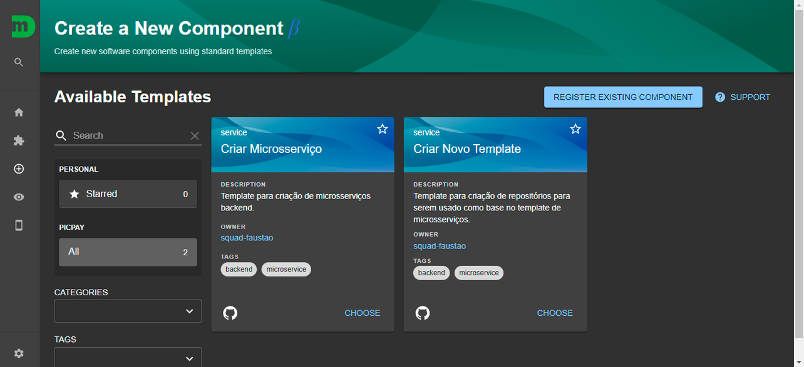

# Funcionalidades

## Catálogo de Componentes

O Catálogo exibe de forma intuitiva e rápida uma listagem dos componentes criados e cadastrados na plataforma, que permite uma busca específica de componentes através das informações:

- Nome
- System
- Owner
- Lifecycle
- Description
- Tags

## Template de criação de microsserviços

Com os templates, é possível criar microsserviços específicos para certas linguagens ou frameworks.

## Pipeline

Pipeline é a automatização dos processos de desenvolvimento de software. Envolve os procedimentos e práticas de CI/CD, que são integradas ao template de criação de microsserviços, que utilizam o Tekton como motor.

Tem como objetivo unificar e padronizar as tarefas de teste, build e deploy em um fluxo único, reduzindo assim, a chance de que tarefas rodem de forma desnecessária caso algum teste falhe. Além disso, traz também tarefas importantes já definidas, reduzindo a chance de falha humana na definição das tarefas a serem rodadas.

No Moonlight Pipeline, podemos executar:

- Testes do [SonarQube](https://picpay.atlassian.net/wiki/pages/createpage.action?spaceKey=PENG&title=Sonar&linkCreation=true&fromPageId=2372438685);
- Build da imagem para containers;
- Deploy em QA;
- Criação de Release no Github;
- Tarefas customizadas;
  - Exemplo: testes, copiar arquivos de um bucket, mostrar alguma mensagem, enfim, qualquer coisa que a pessoa desenvolvedora queira definir e inserir.
