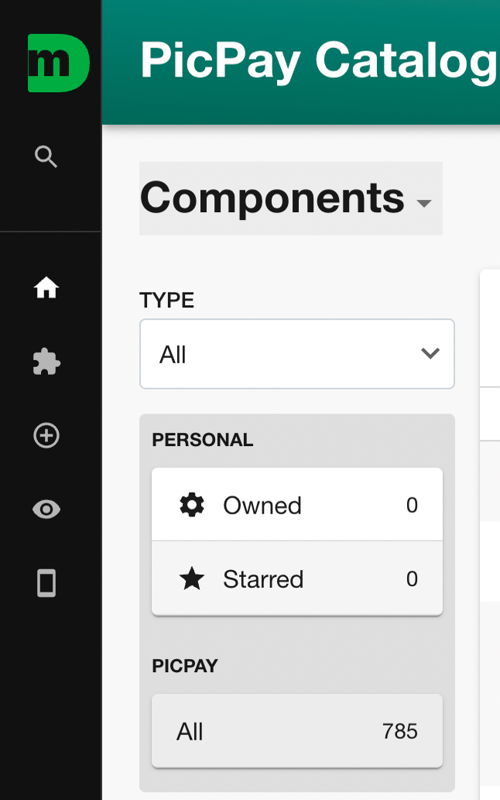
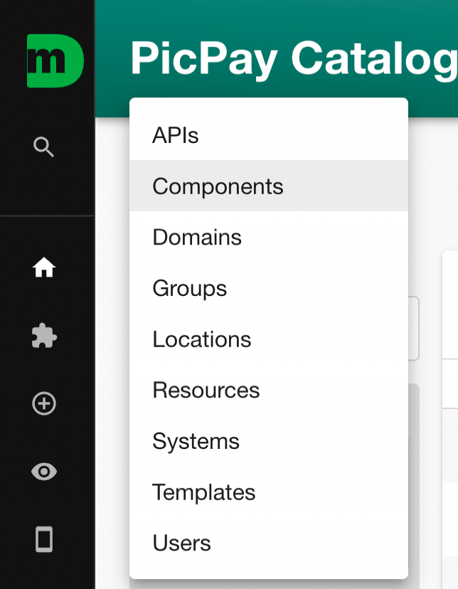
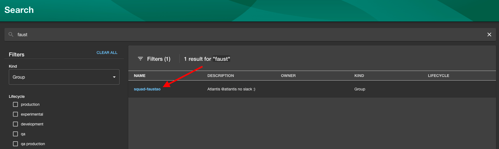
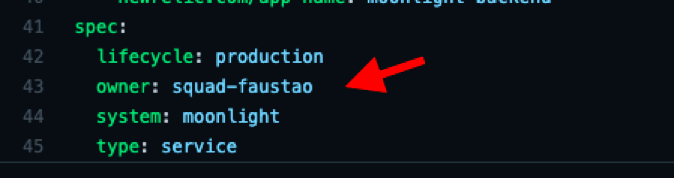
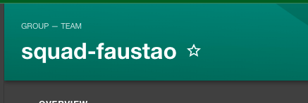

# Gerenciar Equipes

O gerenciamento das equipes no Moonlight é feito através de importação das contas no Github. Para realizar qualquer ação na plataforma, a pessoa deve ter acesso ao Github da organização PicPay e estar vinculada a uma equipe.

Como as equipes são importadas diretamente do Github, a criação e vinculação dos participantes é um pré-requisito para utilizar o Moonlight.

## Consultar as equipes no Moonlight

A consulta das equipes é feita na tela principal da plataforma.

1. Clique em Components;
   
2. Selecione a opção Groups e serão apresentadas todas as equipes importadas para o Moonlight via Github;
   
3. Para pesquisar a equipe, clique no campo Filter e digite o nome conforme consta na conta do Github. Caso não encontre, analise a listagem apresentada.
   
   _Pesquisa da equipe_

Depois de localizar, clique sobre o nome da equipe, abaixo da coluna Name.

Ao abrir é apresentada uma visão geral da equipe, como:

- Squad Faustão: representa o nome do Team do Github. Logo abaixo do nome tem uma descrição que é adicionada no Github;
- Ownership: representa os componentes que a equipe é responsável ;
- Members: representa todos membros dessa equipe, todos são refletidos a partir dos membros que participam do Team do Github;

!!! warning "Atenção" - Toda alteração feita a partir do Github, seja de nome, descrição e membros da equipe são refletidas automaticamente dentro de alguns minutos no Moonlight; - Ainda não é possível fazer alterações a partir do Moonlight para refletir no Github.

## Criar equipe

Caso a sua equipe não esteja cadastrada no Github, será necessário abrir chamado via Zendesk. Para saber como abrir o chamado, clique aqui.

Após a criação e vinculação dos participantes no Github, basta acessar o Moonight e pesquisar a equipe.

## Associar componentes a equipe

Para adicionar os componentes pertencentes a equipe, como Ownership, basta adicionar uma linha de configuração dentro do arquivo “catalog-info.yaml". veja no exemplo abaixo:

_Associação do componente a equipe_

!!! warning "Atenção"
Importante frisar que, o nome adicionado no campo Owner precisa ser igual o nome da equipe, que consta no Moonlight no canto superior esquerdo, ao do símbolo da estrela.

