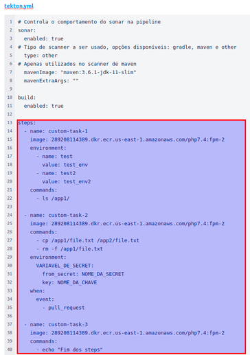
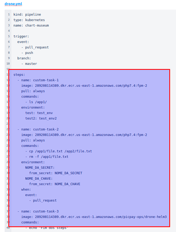
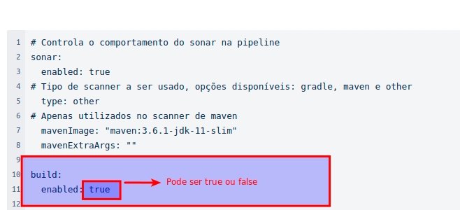
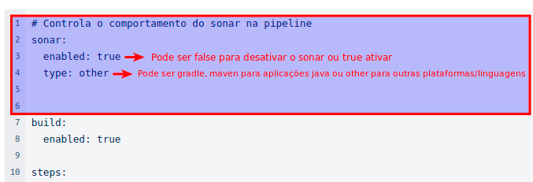

# Adicionar Tasks customizadas

## O que são Tasks?

Tasks são as regras de validação que existem na Pipeline. Todas as Tasks configuradas para um serviço são executadas sempre que a pessoa abre uma PR (Pull Request), uma alteração no código. Atualmente existem 2 tipos de Tasks, padrão e as customizadas.
As Tasks padrões são executadas por Default, para todos os serviços que estão usando a Moonlight Pipeline. Hoje temos duas tasks padrão:

- Fazer testes de SAST no código utilizando uma ferramenta chamada Sonar;
- Realizar validações de regras que são criadas para o fluxo de desenvolvimento, através de uma ferramenta chamada Buildchecker.

Fora essas duas Tasks padrões, os times podem criar as que preferirem para fazer validações no código de seus serviços, como testes unitários por exemplo. Com isso, entram as Tasks customizadas. O time pode customizar para ser executada somente no seu serviço.

## Como adicionar as Tasks customizadas?

O Moonlight Pipeline permite a inserção de algumas tarefas customizadas, caso a pessoa desenvolvedora necessite. Para isso, foi desenvolvido um layout do arquivo tekton.yml, similar ao arquivo drone.yml. Abaixo temos o arquivo do tekton.yml e o do drone.yml, para efeitos de comparação.

_tekton.yml_

```yaml
# Controla o comportamento do sonar na pipeline
sonar:
  enabled: true
  # Tipo de scanner a ser usado, opções disponíveis: gradle, maven e other
  type: other
  # Apenas utilizados no scanner de maven
  mavenImage: 'maven:3.6.1-jdk-11-slim'
  mavenExtraArgs: ''

build:
  enabled: true

steps:
  - name: custom-task-1
    image: 289208114389.dkr.ecr.us-east-1.amazonaws.com/php7.4:fpm-2
    environment:
      - name: test
        value: test_env
      - name: test2
        value: test_env2
    commands:
      - ls /app1/

  - name: custom-task-2
    image: 289208114389.dkr.ecr.us-east-1.amazonaws.com/php7.4:fpm-2
    commands:
      - cp /app1/file.txt /app2/file.txt
      - rm -f /app1/file.txt
    environment:
      VARIAVEL_DE_SECRET:
        from_secret: NOME_DA_SECRET
        key: NOME_DA_CHAVE
    when:
      event:
        - pull_request

  - name: custom-task-3
    image: 289208114389.dkr.ecr.us-east-1.amazonaws.com/php7.4:fpm-2
    commands:
      - echo "Fim dos steps"
```

_drone.yml_

```yaml
kind: pipeline
type: kubernetes
name: chart-museum

trigger:
  event:
    - pull_request
    - push
  branch:
    - master

steps:
  - name: custom-task-1
    image: 289208114389.dkr.ecr.us-east-1.amazonaws.com/php7.4:fpm-2
    pull: always
    commands:
      - ls /app1/
    environment:
      test: test_env
      test2: test_env2

  - name: custom-task-2
    image: 289208114389.dkr.ecr.us-east-1.amazonaws.com/php7.4:fpm-2
    pull: always
    commands:
      - cp /app1/file.txt /app2/file.txt
      - rm -f /app1/file.txt
    environment:
      NOME_DA_SECRET:
        from_secret: NOME_DA_SECRET
      NOME_DA_CHAVE:
        from_secret: NOME_DA_CHAVE
    when:
      event:
        - pull_request

  - name: custom-task-3
    image: 289208114389.dkr.ecr.us-east-1.amazonaws.com/picpay-ops/drone-helm3
    commands:
      - echo "Fim dos steps"
```

Para simplificar o processo de criação da pipe, como dito nos parágrafos acima, abstraímos a complexidade de criação dos objetos do tekton em um único arquivo de valores ou values, no arquivo tekton.yml, do print abaixo temos um exemplo de como ficou este arquivo em relação ao drone.




Por fim caso a pessoa desenvolvedora necessitasse inserir uma quarta tarefa customizada no arquivo yaml do tekton, ele ficaria desta forma:

```yaml
# Controla o comportamento do sonar na pipeline
sonar:
  enabled: true
# Tipo de scanner a ser usado, opções disponíveis: gradle, maven e other
  type: other
# Apenas utilizados no scanner de maven
  mavenImage: "maven:3.6.1-jdk-11-slim"
  mavenExtraArgs: ""
​
build:
  enabled: true

steps:
  - name: custom-task-1
    image: 289208114389.dkr.ecr.us-east-1.amazonaws.com/php7.4:fpm-2
    environment:
      - name: test
        value: test_env
      - name: test2
        value: test_env2
    commands:
      - ls /app1/

  - name: custom-task-2
    image: 289208114389.dkr.ecr.us-east-1.amazonaws.com/php7.4:fpm-2
    commands:
      - cp /app1/file.txt /app2/file.txt
      - rm -f /app1/file.txt
    environment:
      VARIAVEL_DE_SECRET:
        from_secret: NOME_DA_SECRET
        key: NOME_DA_CHAVE
    when:
      event:
        - pull_request

  - name: custom-task-3
    image: 289208114389.dkr.ecr.us-east-1.amazonaws.com/php7.4:fpm-2
    commands:
      - echo "Fim dos steps"

  # Inserindo uma quarta tarefa customizada
  - name: custom-task-4
    image: 289208114389.dkr.ecr.us-east-1.amazonaws.com/php7.4:fpm-2
    commands:
      - echo "Exemplo de inserção de uma quarta custom task"
```

Além disso no código yaml acima, nas linhas entre 1 e 12 temos alguns parâmetros que podem ou não ativar o build e o sonar:

- Build: com um nome bem sugestivo, ao habilitar esta função, ele ira buildar o artefato através do Dockerfile e enviar para o ECR do microsserviço. Um cenário que seria interessante talvez desativa-lo seria em uma pipeline de terraform, pois geralmente não existe a necessidade de criar o build.
  
- Sonar: apesar de ser uma boa prática analisar o código estático via Sonar, a execução dos testes pode ser desativada caso a pessoa desenvolvedora queira.
  

!!! info "Para o sonar funcionar, é preciso que exista o arquivo .sonarcloud.properties no repositório, nesta [doc](https://picpay.atlassian.net/wiki/spaces/MOON/pages/2418114858/Adicionar+Tasks+customizadas#) o arquivo em si é abordado de forma superficial."

### Limitações da customização

O nome da task não deve conter espaços:

- custom task 4 (errado)
- custom-task-4 (correto)

### Limite de caracteres?

Sim, muito cuidado ao nomear suas tasks.

Quando uma task é executada, um pod é criado contendo o nome fornecido pelo time .

Recomendamos usar um limite de 30 caracteres para a nomeação das tasks, pois as tasks tem um prefixo adicionado automaticamente.

Referências:

[Names - Unofficial Kubernetes](https://unofficial-kubernetes.readthedocs.io/en/latest/concepts/overview/working-with-objects/names/)
[Object Names and IDs](https://kubernetes.io/docs/concepts/overview/working-with-objects/names/#dns-label-names)

### Limitações para o uso de comandos na task na pipeline

Limitações para o comando echo na pipeline. Quando utilizamos os “:” como no exemplo abaixo, ele entende isso como um mapa “-”.

Exemplo:

```yaml
commands:
  - echo alguma "coisa: legal"
```

Para resolver isso, pode dessa forma que ele vai entender como string sempre:

```yaml
commands:
  - 'echo alguma "coisa: legal"'
```

**O container deve ter o bash instalado.**
