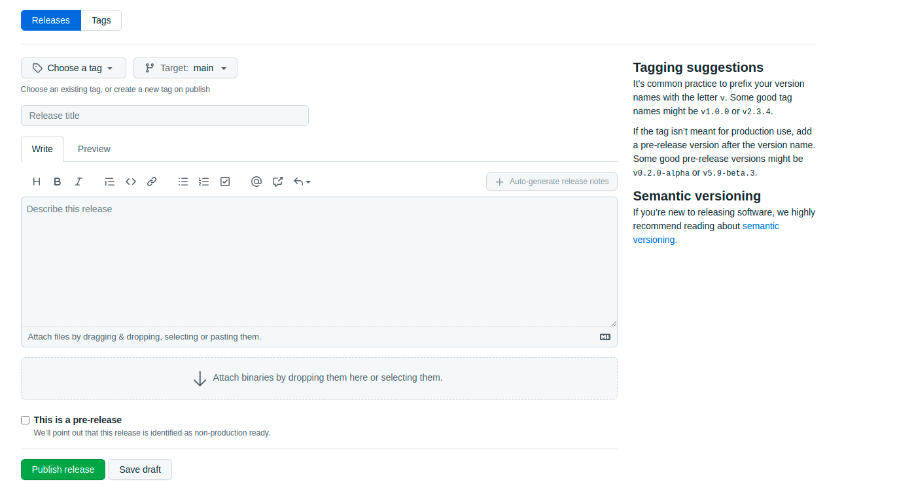
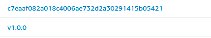

# Como mover o código para ambiente produção

Saiba como realizar a alteração do seu artefato de teste pra produção.

!!! warning "A alteração do seu artefato em produção só poderá ser realizado após validação no ambiente de teste (QA). [Como mover o código para ambiente de teste](como-mover-codigo-ambiente-teste.md)"

## Passos a serem executados

Para realização da alteração do seu artefato até produção, é necessário a execução dos seguintes passos:

- Na sua Branch principal (main), é necessário criar uma release utilizando o padrão do semantic versioning;
  
- Após a criação de sua release, uma tag é gerada, e assim disparando a Pipeline no Tekton, que será responsável pelo tagueamento (promoção) de sua imagem validada em QA, alterando o hash commit para o valor referente a tag. Depois é realizado o push da imagem para o repositório do ECR com o valor da nova tag.
  _Exemplo:_
  - Com hash commit - 289208114389.dkr.ecr.us-east-1.amazonaws.com/picpay-dev/hello-api:c7eaaf082a018c4006ae732d2a30291415b05421
  - Com o tagueamento após a release - 289208114389.dkr.ecr.us-east-1.amazonaws.com/picpay-dev/hello-api:v1.0.0
    

## Deploy em produção

Após a realização do push da imagem com a **tag** referente a **release** selecionada para o ECR, será acionada a task na moonlight pipeline que realizará o deploy em produção via harness de forma automática.
