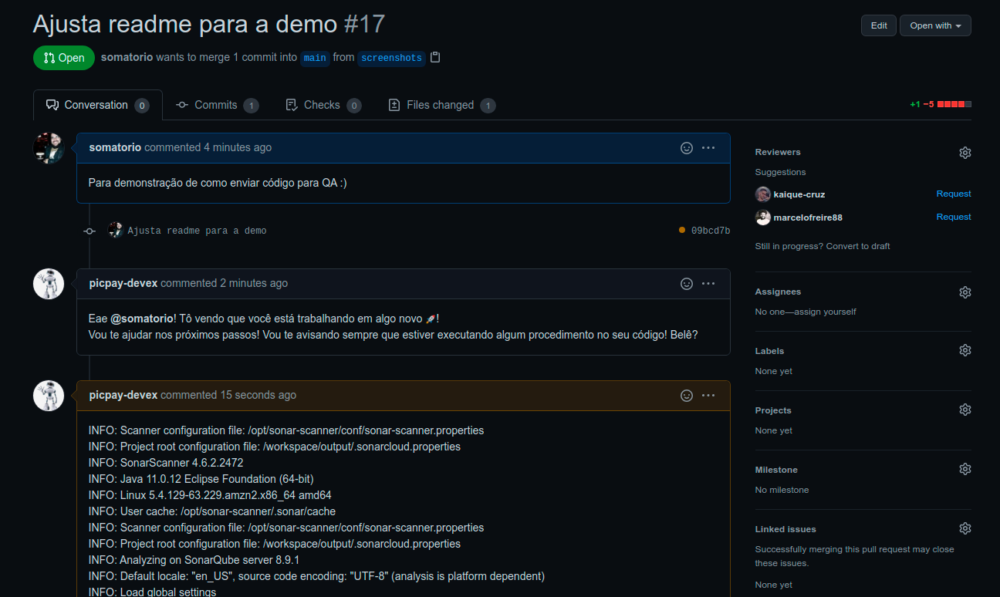
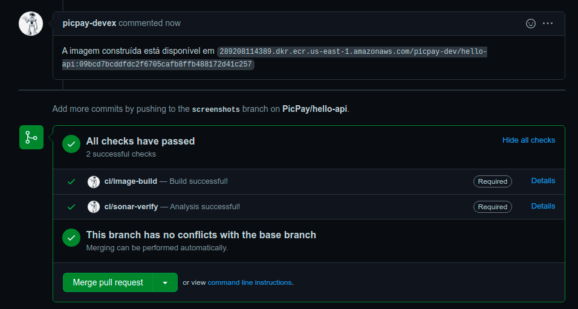
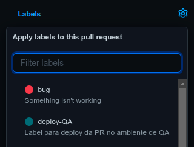
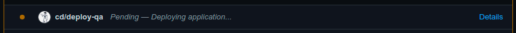

# Como mover o código para ambiente de teste

O Moonlight já faz a maior parte da configuração no repositório, levar seu código até QA é tão simples quanto adicionar uma Label em uma PR.

Para mover para QA, basta abrir uma PR e confirmar que todos os testes e Build da imagem foram completos com sucesso, depois é preciso adicionar a Label `deploy-QA`.

_Uma Pull Request (PR)_

_Como pode ver os testes já rodaram e a imagem a ser deployada já está construída_

_Clique e selecione a Label_

Ao fazer isso, será disparado um Webhook para a Pipeline, que por sua vez irá disparar o Deploy em QA no Harness.

_Alguns segundos após adicionar a label, a tarefa começa a rodar_

!!! warning "ATENÇÃO: Como o deploy ocorre via Harness, dependemos da disponibilidade, em caso de queda deste sistema o disparo irá falhar. [Verifique o status do Harness](https://status.harness.io/)."

## Como fazer um novo Deploy em cima da mesma PR?

Quando a Label estiver aplicada na PR, todos os próximos commits já serão deployados de forma automática em QA.

!!! info "Não será feito o deploy quando o novo commit não possuir a imagem buildada com sucesso."
