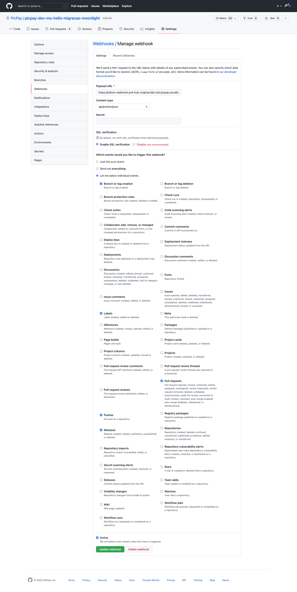
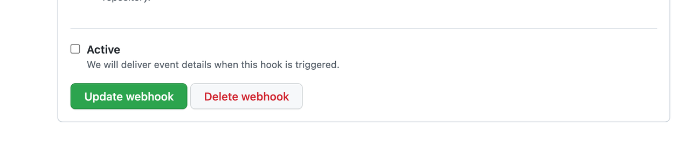
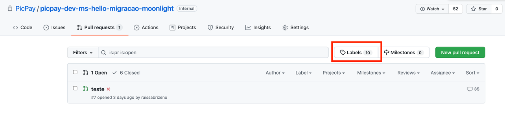
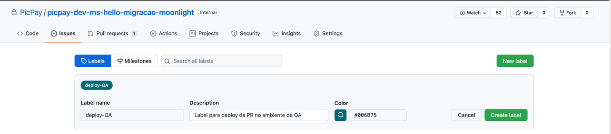
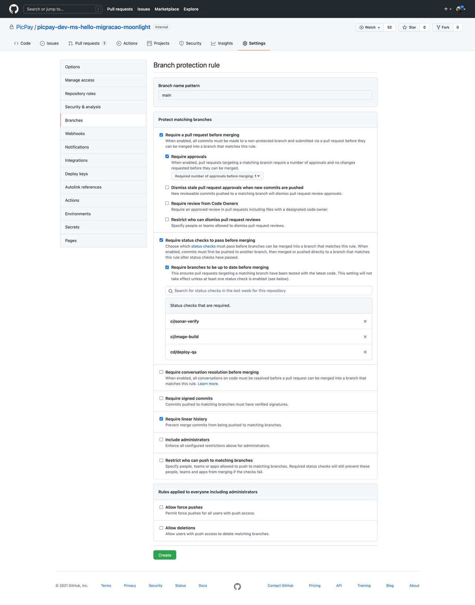

# Configuração no Github

Essas configurações precisam ser aplicadas no repositório do projeto no Github:

## Configurando os Webhooks

!!! info "Conforme informado nos [Requisitos](https://picpay.atlassian.net/wiki/spaces/MOON/pages/2429453385), solicite ajude ao time de SRE caso não tenha acesso ao menu Settings do Github."

1. Configure o grupo Deploy Pipeline no repositório do Github. Admin: settings > manage access > add teams > buscar por Deploy Pipeline e adicionar como Admin.

2. Adicionar o Webhook do Tekton no repositório do Github com os eventos marcados:

3. Settings > Webhooks > add Webhook, preencher como na imagem abaixo. A URL do webhook do Tekton completa é: <br>
   `https://tekton-webhook.prd-hub-virginia.k8s.hub.picpay.cloud/microservices`
   

4. Desative o Webhook do Codebuild:

5. Settings > Webhooks > edite o Codebuild Webhok e no fim da página desmarcar a opção **Active**, após retirada a seleção, é preciso clicar em **Update Webhook**.
   

   !!! warning "[ATENÇÃO] Não deletar o webhook do codebuild, apenas desativar."
   !!! warning "[ATENÇÃO] Se houver o webhook do Drone, é necessário desativa-lo também da mesma forma que foi feito para o codebuild."

## Configurações no repositório

1. Criar o Arquivo com o nome .moonlight.yaml na raiz do projeto com o seguinte conteúdo padrão:

```yaml
sonar:
  type: other

build:
  enabled: true
```

!!! info "Esse arquivo permitirá, da forma como está, o build e push da aplicação, e a análise do Sonar. Para adicionar tasks customizadas poderá seguir esta documentação."
!!! warning "Após isto, é necessário abrir um novo PR, e executar novamente o processo de build e a tag da imagem passará a ser o hash commit e não mais o número de build. Assim conseguirá deployar com a label do passo abaixo."

2. Criar label deploy-QA:
1. No repositório do Github da aplicação acesse a aba de Pull requests e clique em Labels:
   
1. Clique em New Label e configure como na imagem a seguir.
   
   !!! warning "É necessário que o nome da label seja exatamente deploy-QA, caso contrario não funcionará o deploy."

## Configurando as Proteções de Branch

!!! info "Somente após realizar o primeiro build e adicionar a label de deploy, os status checks ficarão disponíveis para serem adicionados nas regras de proteção de branch."

1. Proteger a branch default no repositório do Github:
1. Settings > Branches > Add rule;
1. Colocar a branch default no campo Branch name pattern (criar um para cara branch que deseja proteger, ex: develop.);
1. Selecionar a opção Require a pull request before merging e escolher uma quantidade mínima de approvals;
1. Selecionar a opção Require status checks to pass before merging, na barra pesquise os Status checks e adicione-os como na imagem abaixo. Os status relacionados ao codebuild devem ser removidos;
1. Selecionar Require linear history;
1. Ao finalizar clicar em create.


