# Configuração no Harness

Veja quais as as configurações que precisam ser aplicadas no Harness para a sua aplicação.

## Trigger de Deploy

1. Adicionar trigger de deploy no setup da aplicação no Harness:
1. Ir na página de setup, em Harness e pesquisar pela aplicação na barra de buscar, depois clicar para ser exibida e selecionar a opção Triggers;
   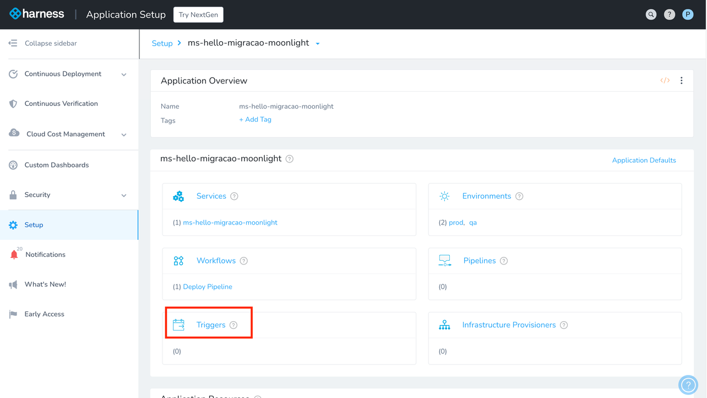
1. Ao clicar em Add trigger, será preciso configurar. Preencher o name e clicar em next;
   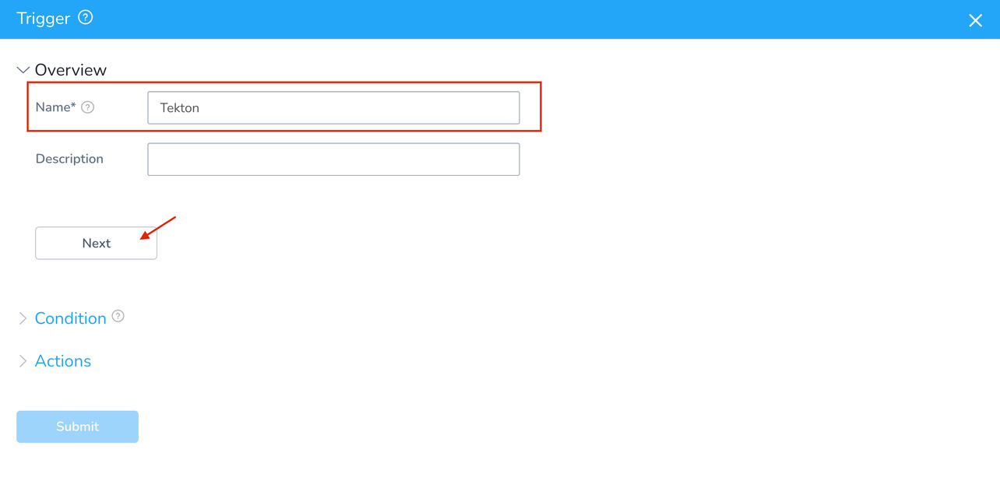
1. Selecionar o Webhook Event, deixar o tipo como custom e clicar em next;
   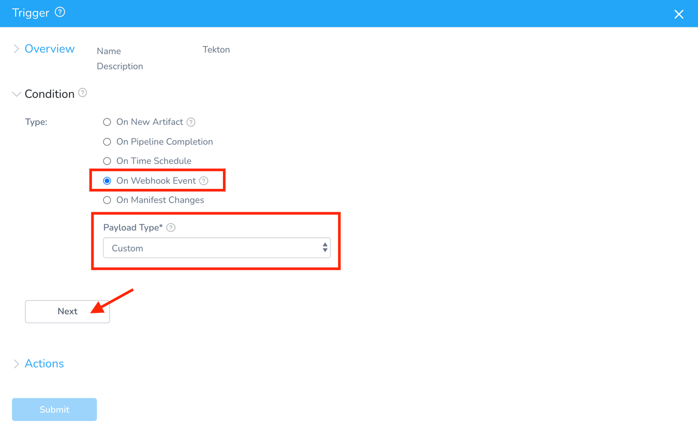
1. Em Workflow > Deploy Pipeline, os campos se expandem ao selecionar as opções. Após preencher, clicar em next;
   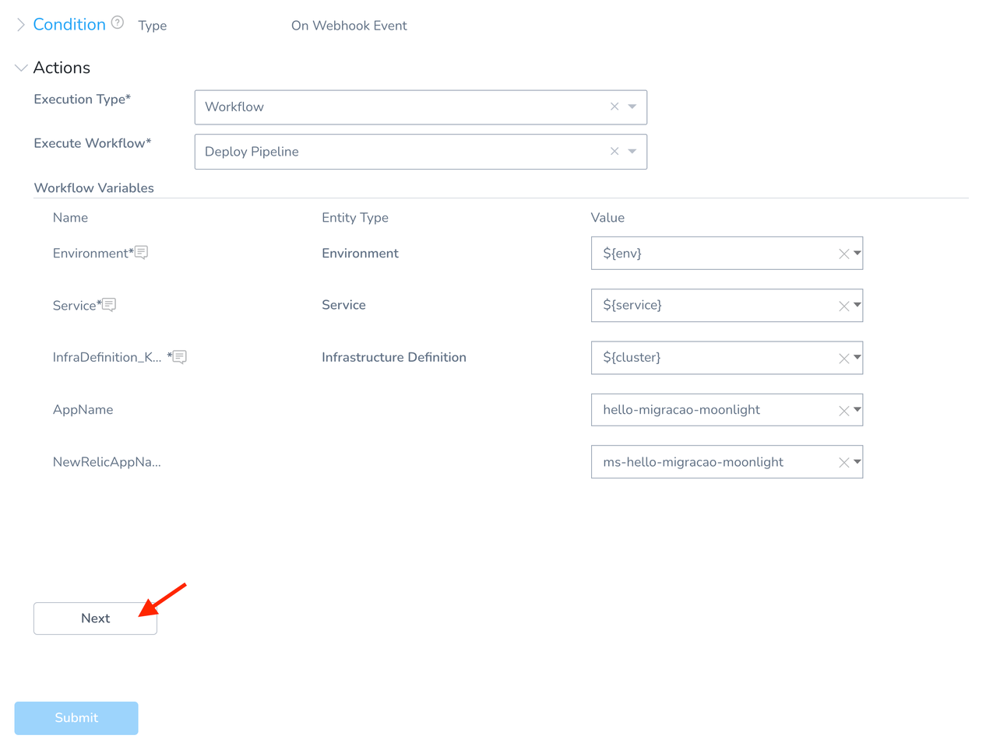
1. Conferir todas as informações e clicar em Submit;
   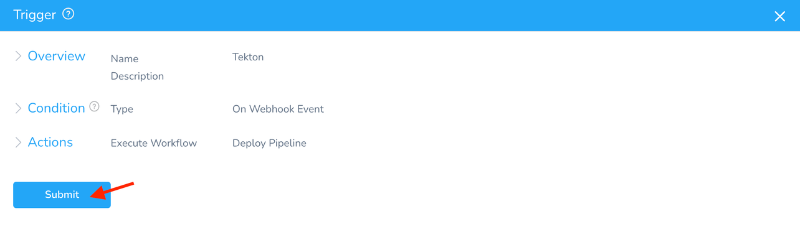

## Integração com JIRA

As configurações descritas à seguir são necessárias para que cada deploy na aplicação gere um registro no board de mudanças do JIRA.

O Workflow de Deploy Pipeline passará a conter a seguinte estrutura:

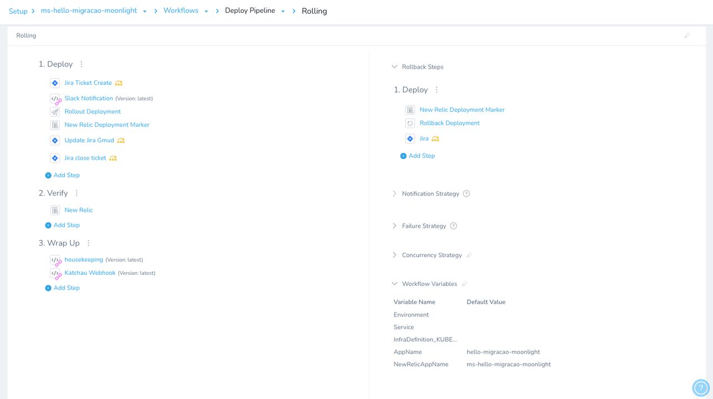
_Resultado final das modificações no Workflow de deploy pipeline_

Para começar a edição, é preciso clicar no workflow de **Deploy pipeline**:

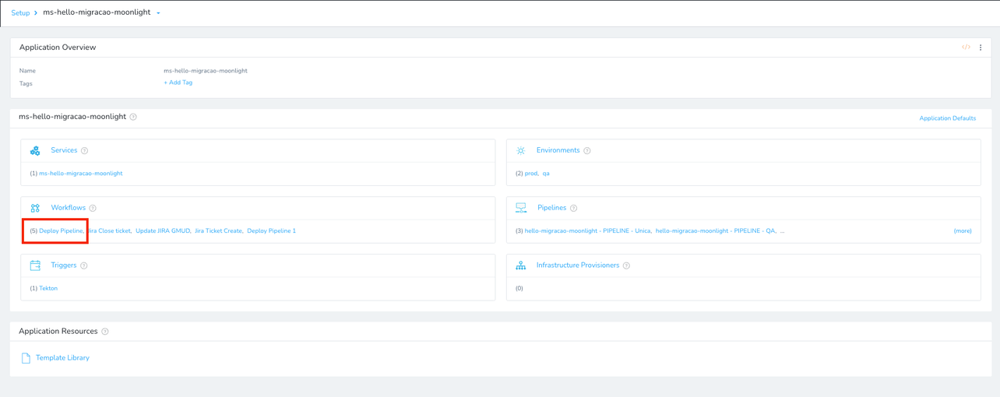

1. Deploy:
   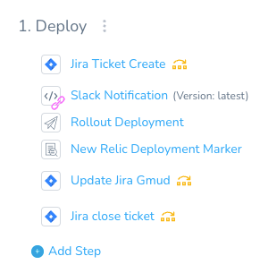

- Adicionar o step Jira Ticket Create:

  - Clicar em Add Step e na barra de pesquisa procurar por Jira e selecionar qualquer uma das caixinhas que conter Jira;
    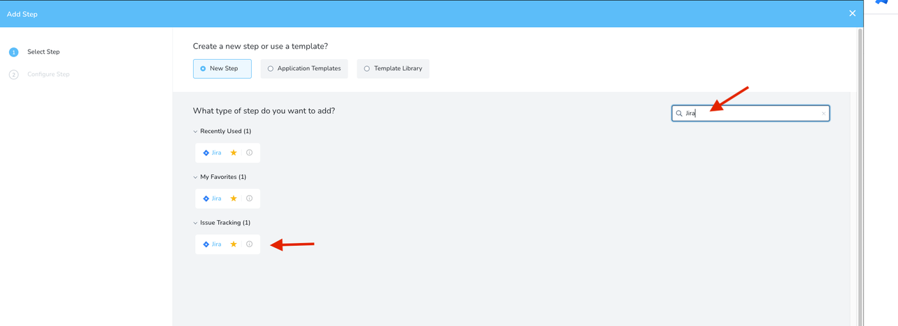
  - Preencher o configure step como na imagem abaixo e clicar em submit;
    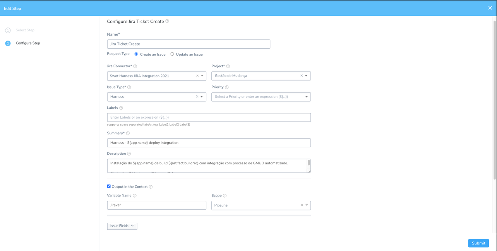

    !!! info "Texto do campo Description:"

        ```
        Instalação do ${app.name} de build ${artifact.buildNo} com integração com processo de GMUD automatizado.
        Started by: ${deploymentTriggeredBy}
        ```

  - Adicionar step Update Jira Gmud:

    - Clicar em Add Step e na barra de pesquisa procurar por Jira e selecione qualquer uma das caixinhas que conter Jira;
    - Preencher o configure step como na imagem abaixo e clicar em submit;
      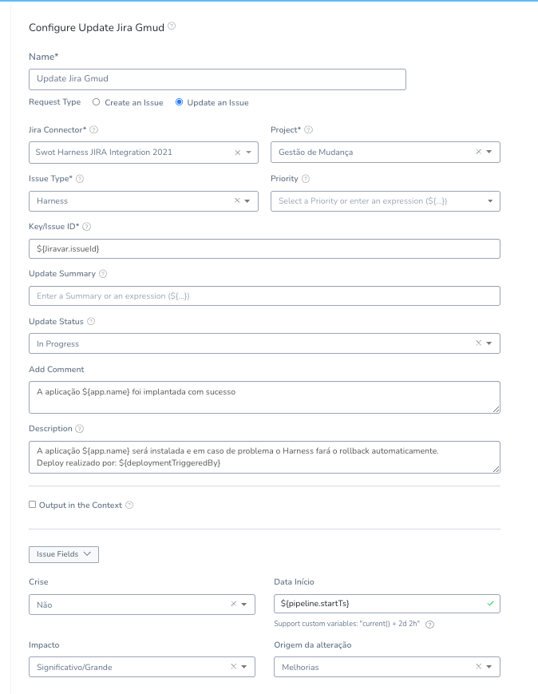
      _Step Update Jira Gmud_

      !!! info "Texto do campo Description:"

          ```
          A aplicação ${app.name} será instalada e em caso de problema o Harness fará o rollback automaticamente.
          Deploy realizado por: ${deploymentTriggeredBy}
          ```

  - Adicionar step Jira Close Ticket:
    - Clicar em Add Step e na barra de pesquisa procurar por Jira e selecionar qualquer uma das caixinhas que conter Jira;
    - Preencher o configure step como na imagem abaixo e clicar em submit.
      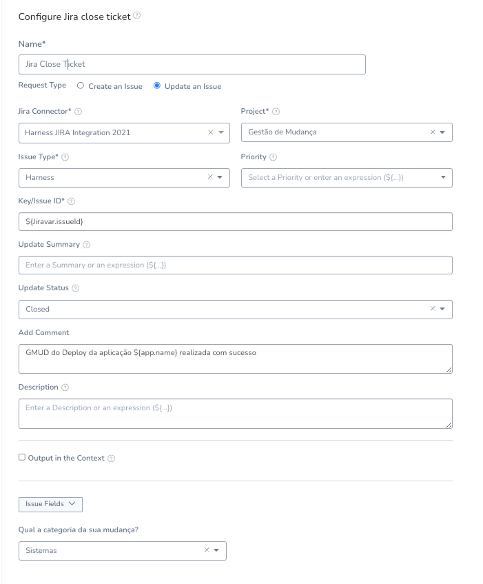
      _Step Jira Close Ticket_

!!! info "Os próximos steps referentes ao Jira serão adicionados na parte de Deploy dos steps de rollback."

2. Rollback Steps: Deploy.

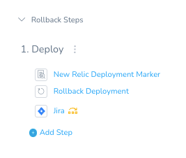
_Rollback Steps: Deploy_

- Adicionar step Jira:
  - Clicar em Add Step e na barra de pesquisa procurar por Jira e selecionar qualquer uma das caixinhas que conter Jira.
  - Preencher o configure step como na imagem abaixo e clicar em submit;
    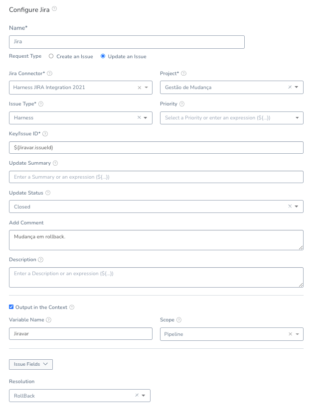
    _Jira em rollback steps_

3. Skip dos steps do Jira para deploy em qa:

!!! warning "Os steps referentes ao Jira só devem ser executados quando o deploy for para o ambiente de Prod, para isso deveremos adicionar uma condição de skip para quando o ambiente for qa."

- Clicar nos três pontinhos e selecionar a opção Conditional (view | edit) em Execution;
  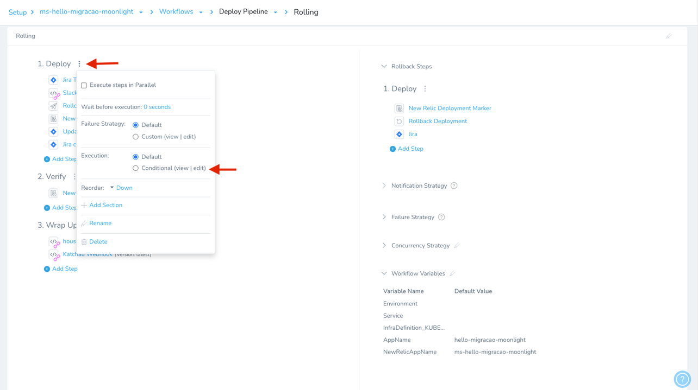
  _Conditional (view | edit)_

- Selecionar Selected steps e preencher como abaixo e clicar em submit;
  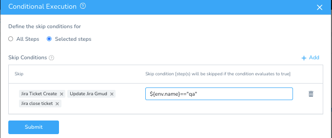
  _Condições para skipar os steps referente ao Jira para ambiente de QA_

- Clicar nos três pontinhos da opção Deploy em Rollback Steps e selecionar a opção Conditional (view | edit) em Execution;
  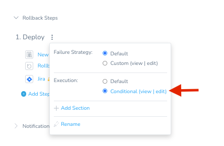
  _Conditional (view | edit)_

- Selecionar Selected steps e preencher como abaixo e clicar em submit;
  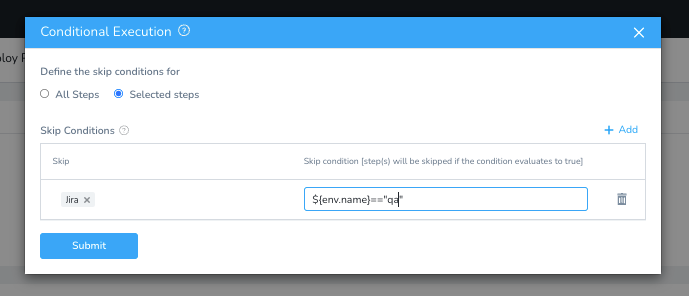
  _Condições para skipar o step do Jira para ambiente de qa_

4. Ordenamento dos steps

Para mudar a posição dos steps nas seções é só clicar nas setinhas que eles possuem ao lado, quando depositamos o mouse em cima.


5. Deletar workflows antigos do Jira

Caso o setup da sua aplicação constar os workflows relativos ao Jira, ao configurar os steps, tudo irá ficar contido dentro do workflow de deploy pipeline, sendo assim, podemos fazer a exclusão dos workflows antigos referentes ao Jira. Se não houver, pode pular esse passo.

Para fazer a exclusão é só clicar em workflows > clicar nos três pontos > Delete > Confirm Delete. Repetir este processo para os workflows: Jira Create Ticket, Jira Close Ticket e Update Jira Gmud.

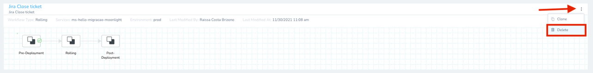
