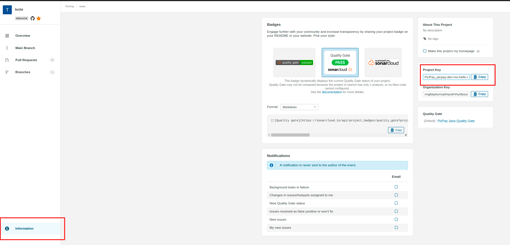

# Requisitos para Migração

Conheça quais são os requisitos que identificam os serviços que estão aptos à serem migrados para a Moonlight Pipeline, além dos níveis de acesso necessários para completar o processo de migração.

## Requisitos

1. O repositório precisa ter sido criado via Rundeck, que empregava como nome padrão <b>picpay-dev-ms-\*</b>. Não é preciso mudar esse nome;
2. Agent do NewRelic configurado;
3. Possuir o arquivo [catalog-info.yaml](https://picpay.atlassian.net/wiki/spaces/PENG/pages/2310504627/Cat+logo+de+Componentes) dentro da raiz do repositório no Github;
4. O [Sonar](https://picpay.atlassian.net/wiki/spaces/DevEX/pages/2058682702) configurado no **.sonarcloud.properties** e o projeto **já criado no sonarcloud**. Caso o projeto não esteja adicionado ao sonar, chame o SRE do seu time para auxilia. Depois disso, siga com os próximos passos.

!!! warning "Caso o Sonar esteja configurado no pom.xml, será necessário migrar as configurações para o arquivo .sonarcloud.properties"

_Como conseguir a informação do seu Project Key_

5. Ter acesso ao settings do repositório no Github, caso ninguém do time tenha permissão, peça ajuda ao time de SRE para aplicar as configurações;
