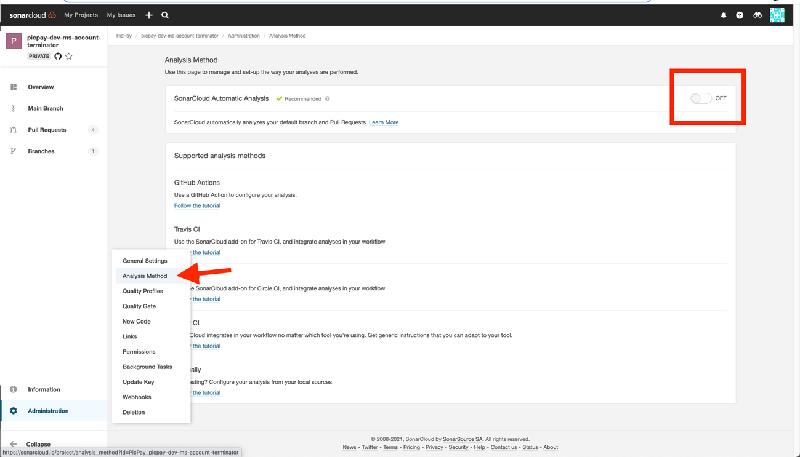

# Solução de problemas

Dicas para resolver problemas que podem ocorrer no processo de migração para a Moonlight Pipeline.

## Falha no Step do Sonar

A pipeline de build poderá falhar no step do sonar e apresentar o erro de que a análise automática está ativada, basta acessar o projeto em [sonarcloud.io](https://sonarcloud.io/) > Administration > Analysis Method e desabilitar o botão SonarCloud Automatic Analysis.

