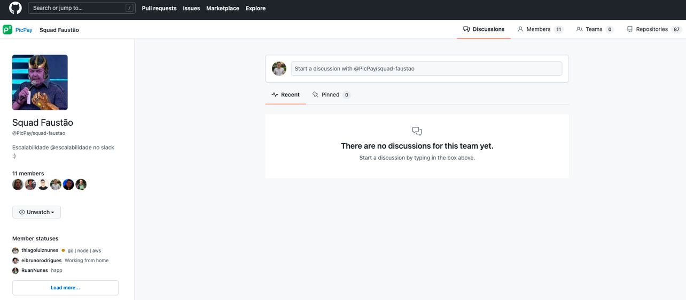
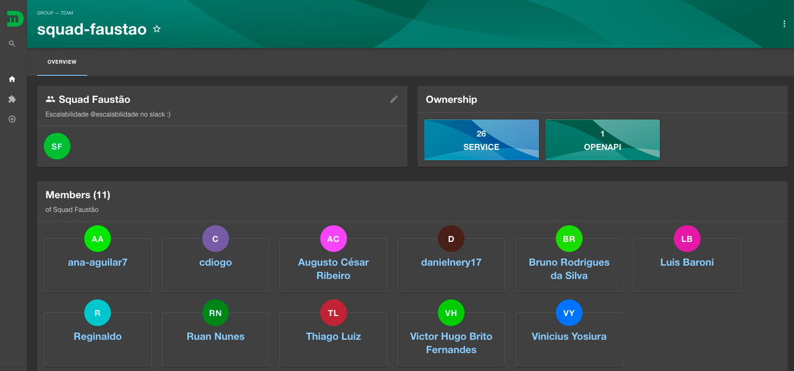

# Requisito

Para utilizar o Moonlight e criar o microsserviço, é preciso cumprir apenas um requisito:

1.  **Possuir conta no GitHub**.

Para o funcionamento completo é necessário:

- **Vincular o cadastro na organização do PicPay.**
  O mecanismo de pesquisa do Moonlight utiliza as credenciais geradas na criação de um GitHub App como forma de autenticação, e através desse acesso, realiza uma varredura na organização do PicPay em busca de todos os serviços que possuem o arquivo _catalog.yaml_ configurado na raiz do repositório, assim como todos os times que estão inseridos na organização.

- **Configurar o perfil como membro no time de desenvolvimento**, que atua internamento no PicPay. Para que o Moonlight possa vincular as devidas atribuições, tanto ao responsável pelos serviços e aos desenvolvedores responsáveis pelo time.

Squad Faustão no GitHub

Squad Faustão no Moonlight
