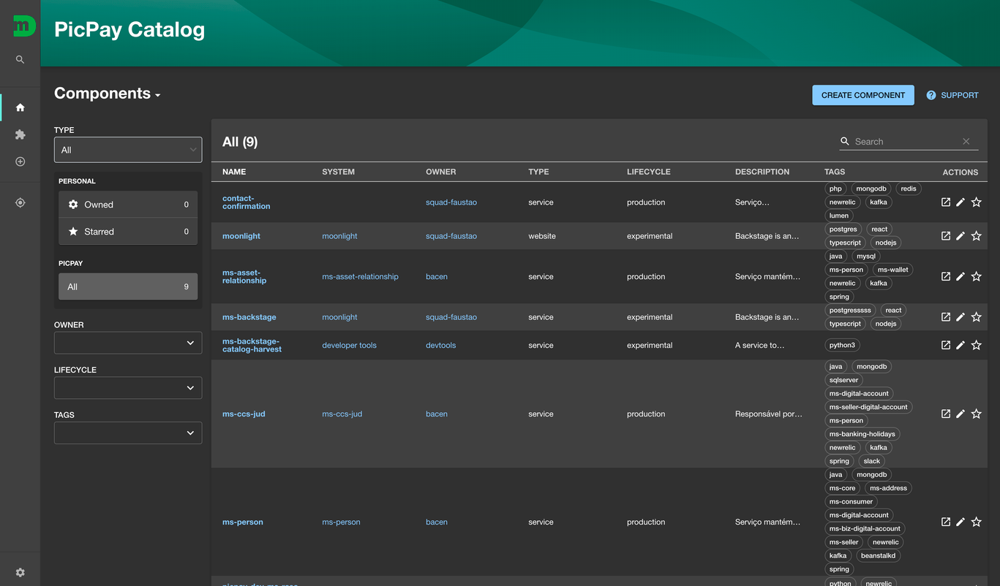
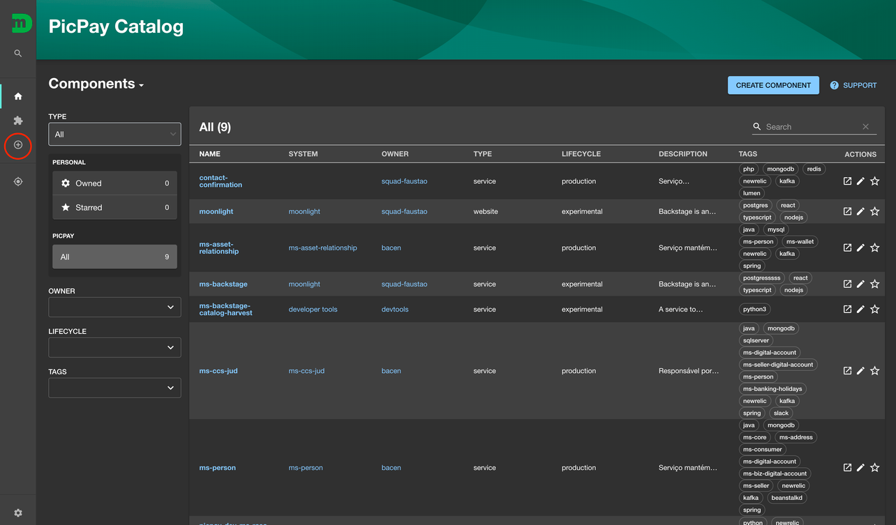
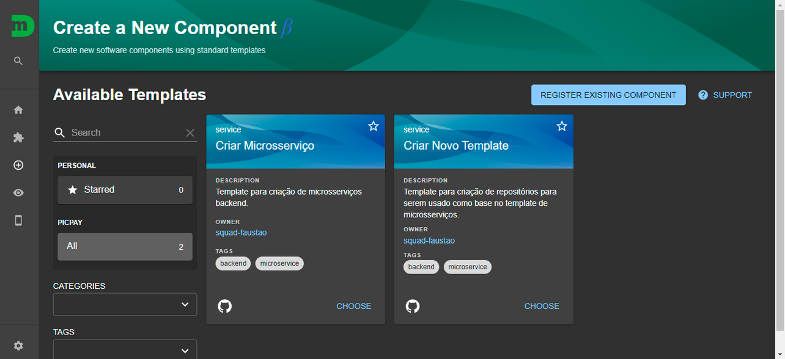
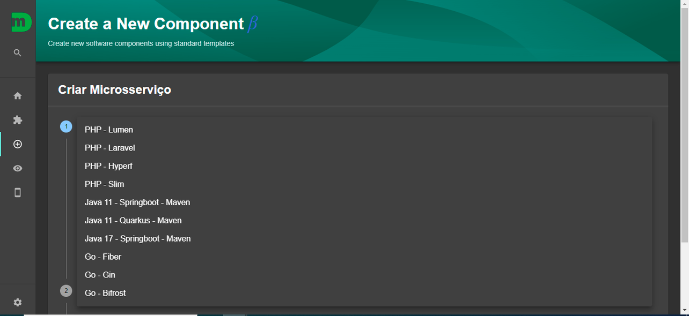

# Acessar os templates

Na criação de um microsserviço pelo Moonlight, será apresentada uma lista de todos os Templates disponíveis, [clique aqui](https://moonlight.limbo.work/create) ou basta seguir o passo a passo:

1. Acesse o Moonlight;
   
2. No menu lateral esquerdo, clique em Create/Criar;
   
3. Serão listadas as opções de Criar novo microsserviço através de um template ou criar um novo template:
   
4. Selecionando Criar microsserviços serão listados os templates disponíveis;
   

Caso necessite de ajuda ou suporte, você pode contatar alguém do [#team-atlantis](https://picpay.slack.com/archives/C027R7JLABF) no Slack.
