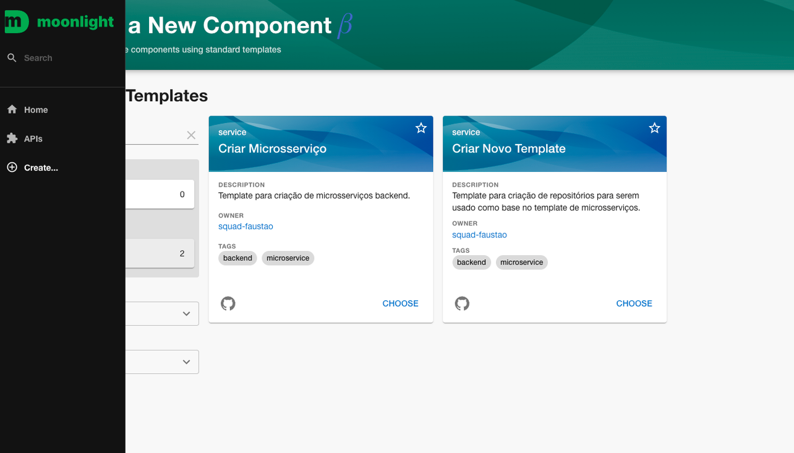
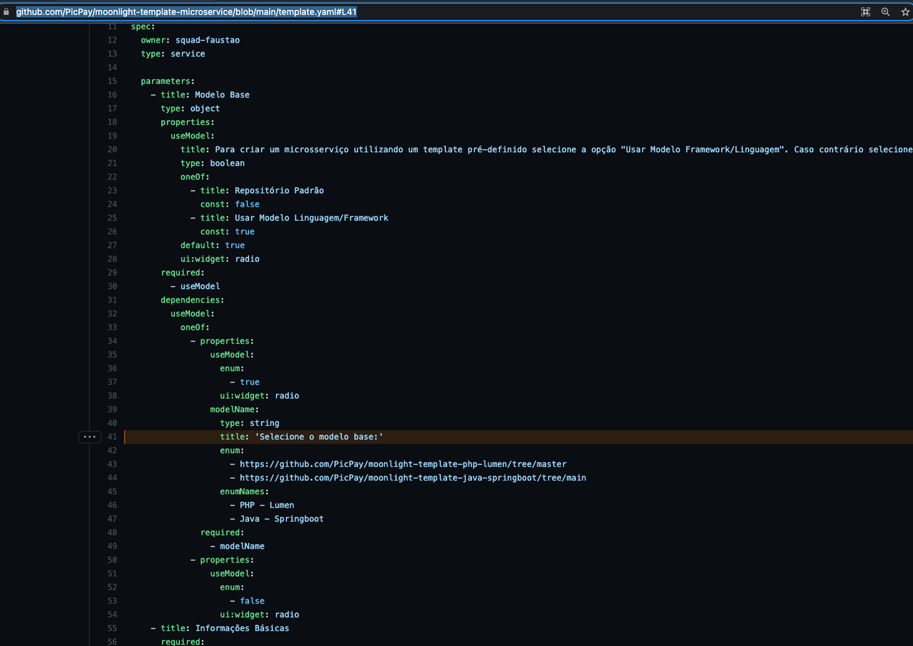
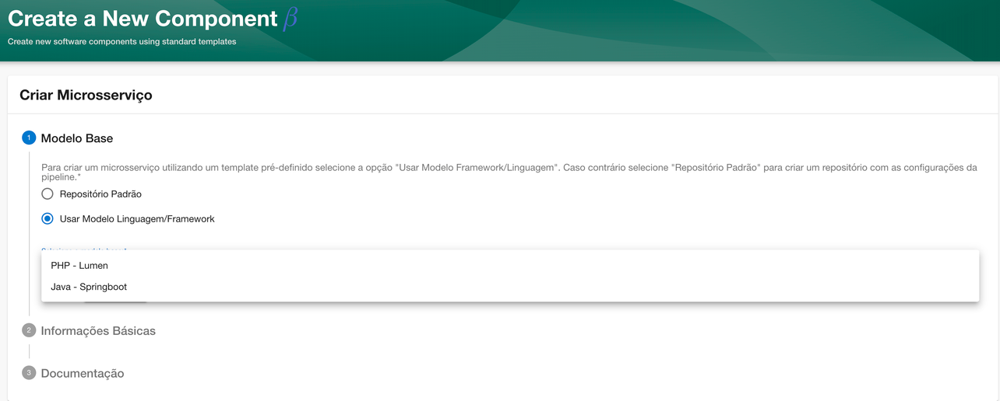

# Adicionar um novo Template

Visando contribuir com a melhoria nos templates das linguagem existente e/ou criação, a pessoa desenvolvedora pode fazer parte disso. Basta seguir esse passo a passo:

1. Acesse o moonlight Moonlight;

2. Clique em Create, escolha a opção Cria Novo Template;
   
3. Ao preencher as informações básicas, é preciso seguir esse padrão:

   - Nome do modelo em kebab-case (Ex: php-lumen);
   - Escreva no mínimo 2 caracteres e no máximo 50;
   - Apenas letras minúsculas;
   - Não use acentos;
   - Não use números;
   - Separe as palavras por hífen;
   - Use o padrão {linguagem-framework} (caso a linguagem tenha mais de 1 builder, Ex: maven,gradle) adicione no final {-builder};

   Seguindo os padrões, será gerado automaticamente o repositório com o nome "moonlight-template+nomequefoiinserido". Depois de gerar arquivo, é possível localizar o repositório no github.
   

4. Após gerar o arquivo, é necessário abrir uma PR no repositório do modelo padrão (https://github.com/PicPay/moonlight-template-microservice/blob/main/template.yaml#L41), pra adicionar no Dropdown dos templates.
   

O novo template será exibido ao criar um novo microsserviço.

