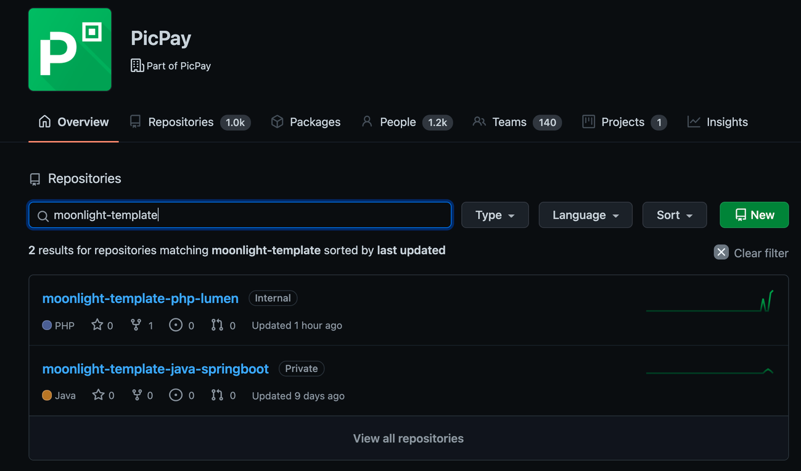

# Contribuir com melhorias no template existente

## Quais as possibilidades de contribuição com o template?

É possível contribuir criando um novo template ou colaborar com melhorias em um template já existente. Podendo também, reportar um bug encontrado.

## Como contribuir com melhorias em um template existente?

Basta criar um `PULL REQUEST` no template. O nome do repositório segue o padrão moonlight-template-nomedalinguagem.

A contribuição pode ser desde a padronização no código, como nomenclatura de métodos e variáveis até o espaçamento e a indentação do código ou correção de bug.

