# Criar um microsserviço via template

Para criar um microsserviço via Template, basta seguir os seguintes passos:

### Passo 1

No menu esquerdo, clique no botão Create/Criar.
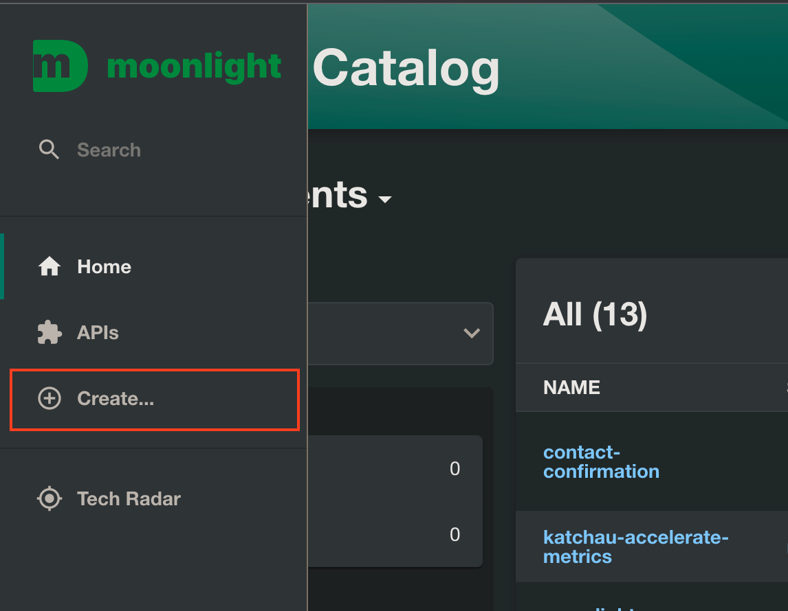

### Passo 2

Selecione o template Criar Microsserviço e clique em Choose.
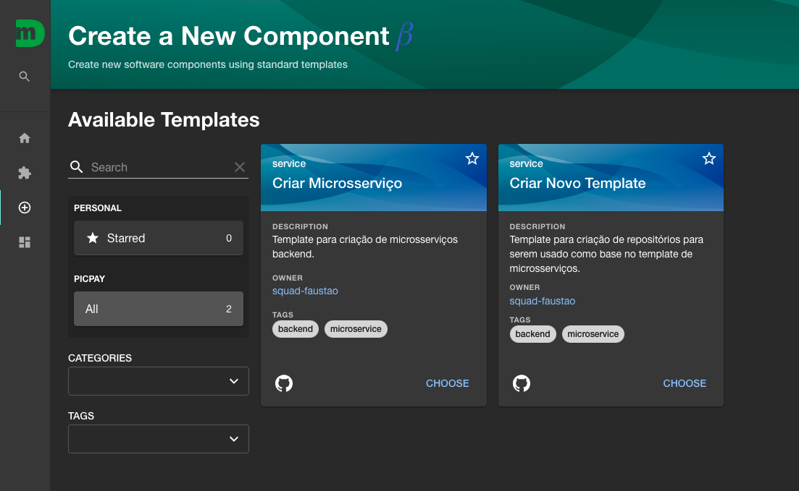

### Passo 3

Nessa tela, deve ser escolhido o template modelo da linguagem/framework ou apenas criar um repositório vazio. Utilizando um modelo, o serviço já será criado com todo o CI/CD, configurado e estará pronto para o Deploy, assim que finalizar a criação.
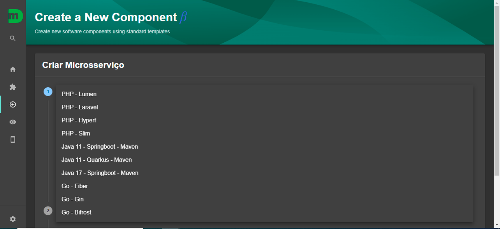
Caso contrário você terá que realizar algumas ações manualmente.

!!! warning inline "Atenção"
Caso não encontre o template para a linguagem ou framework que deseja criar o serviço, é possível contribuir, criando o próprio template. Saiba mais em [Quero contribuir](https://picpay.atlassian.net/wiki/spaces/PENG/pages/2310013239/Quero+contribuir).

!!!info "Utilizando um modelo pronto, já virá configurado os seguintes serviços:" - CI/CD - Docker - Helm Chart - Sonar com coverage

    O serviço já fica pronto para deploy!

### Passo 4

Uma tela solicitando mais informações sobre o novo serviço será exibida, deverá dar um nome ao serviço, usando o padrão kebab-case.

!!!info "Padrão kebab-case usa apenas letras minúsculas separadas por hífen, mín 3 e máx 50 caracteres."

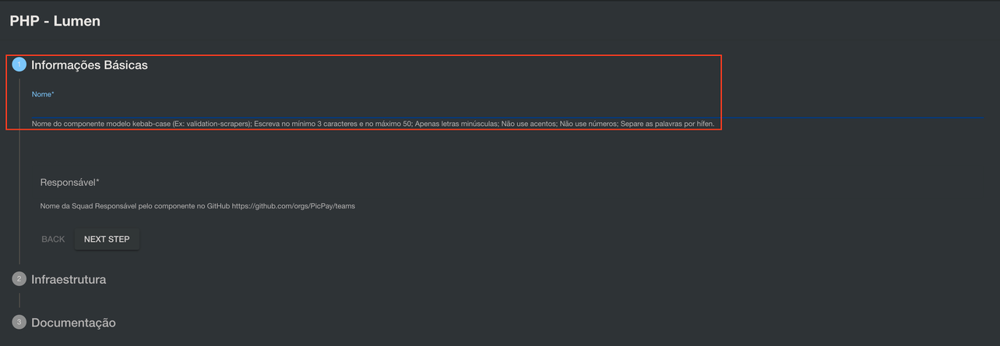

### Passo 5

Após dar um nome ao serviço, clique no campo Responsável, e informe qual o grupo do Github é responsável pelo serviço;
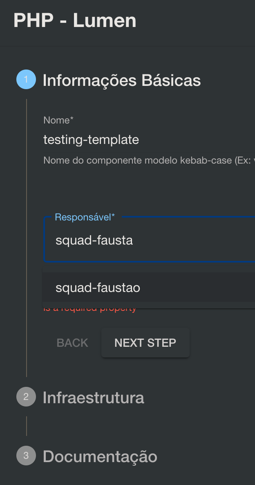

!!!info "O campo "Responsável” é alimentado pelos grupos existentes no Github."

### Passo 6

Clique em Next Step;

### Passo 7

No Step seguinte, é preciso informar quais os recursos de infraestrutura o serviço utilizará. Clique em ADD ITEM para incluir os recursos necessários.
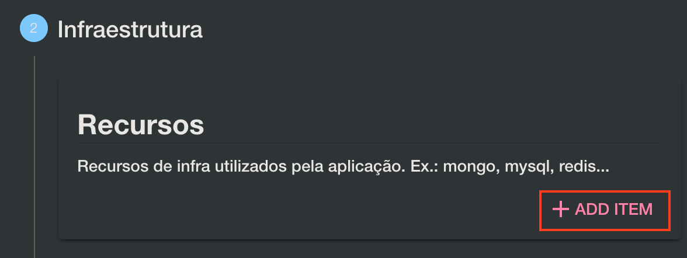
Deve ter um resultado similar a este:
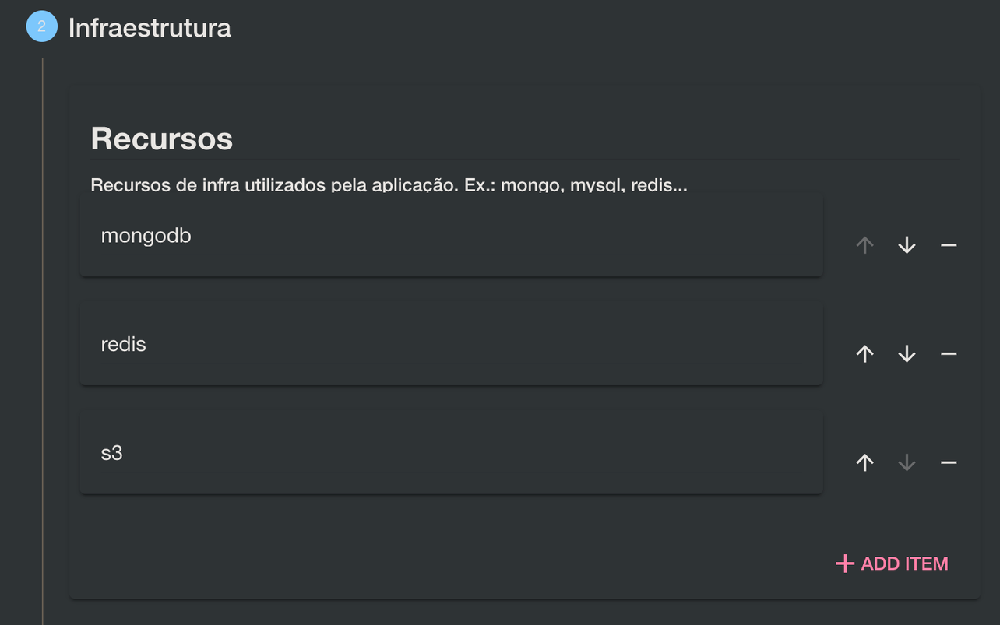
!!!tldr "As informações adicionadas no campo Recursos, serão convertidas em Tags que serão visualizadas dentro do Catálogo de Componentes. Esse step ainda não contempla a criação dos recursos de infraestrutura de forma automatizada."

### Passo 8

No Step seguinte, será necessário informar quais são as dependências do serviço, que podem ser outros serviços ou APIs.
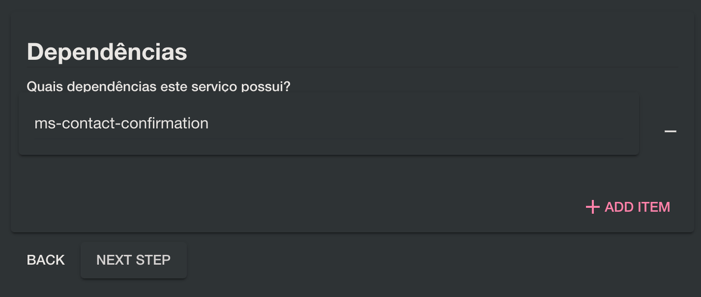

### Passo 9

Preencha as informações de Documentação e Links do Jira e Confluence relacionados a Squad responsável pelo serviço.

### Passo 10

Clique em Next Step.

### Passo 11

Revise com atenção os dados preenchidos.
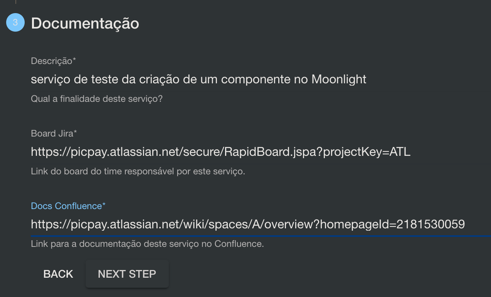

### Passo 12

Após validar, caso esteja tudo correto, clique em Create.

---

## O que fazer em seguida?

Depois de criar o serviço, para realizar a publicação em ambiente de QA é preciso:

!!! warning "Os passos abaixo são apenas para serviços criados utilizando um template, caso tenha optado por não usar, será preciso criar e definir seus HelmCharts e configurar o CD no Harness."

1. Realize uma alteração no repositório em uma `BRANCH` que não seja a `main`;
2. Abra um `pull request` para a `main`;
3. Solicite a aprovação de um par;
4. Do lado direito, terá uma seção chamada Labels;
   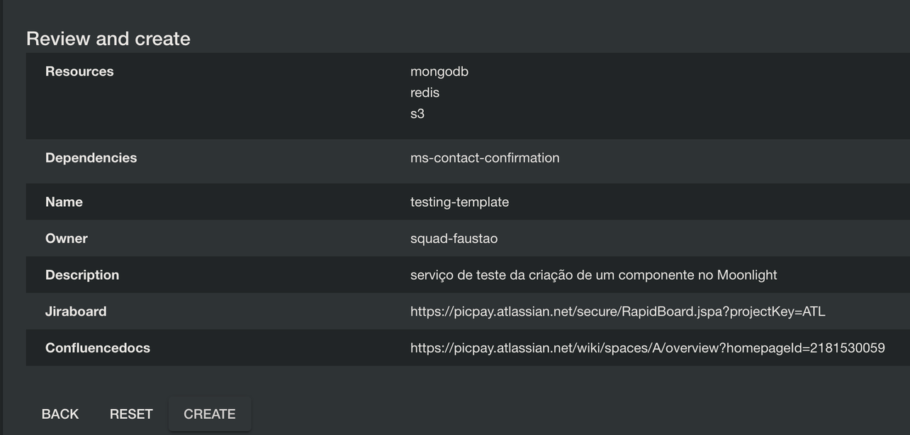
5. Clique em Label e selecione Deploy-QA;
   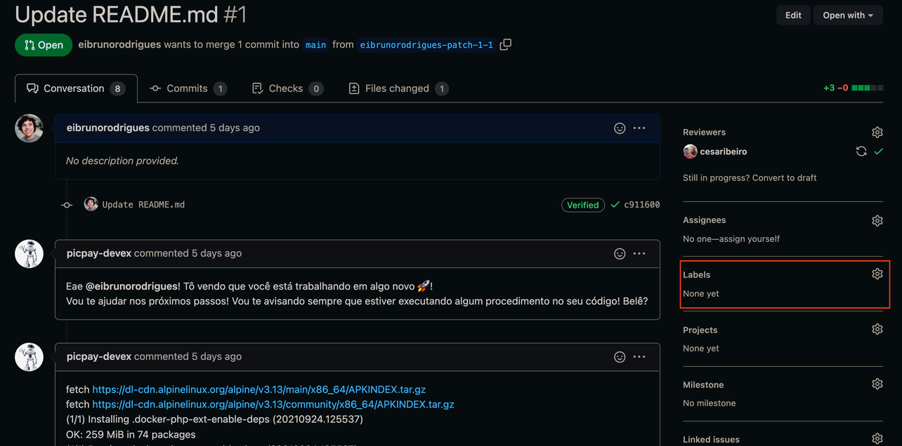
6. Após selecionar, clique novamente em Labels ou fora da caixa de opções para fechar a caixa;
7. Em alguns instantes a publicação no ambiente de QA iniciará, e na parte inferior da página, poderá acompanhar a publicação;
   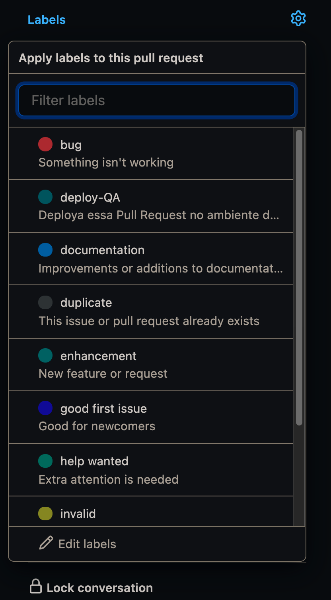
8. Caso algum erro de publicação ocorra, será enviado um comentário no PULL REQUEST , e poderá analisar os problemas encontrados clicando em Details.
   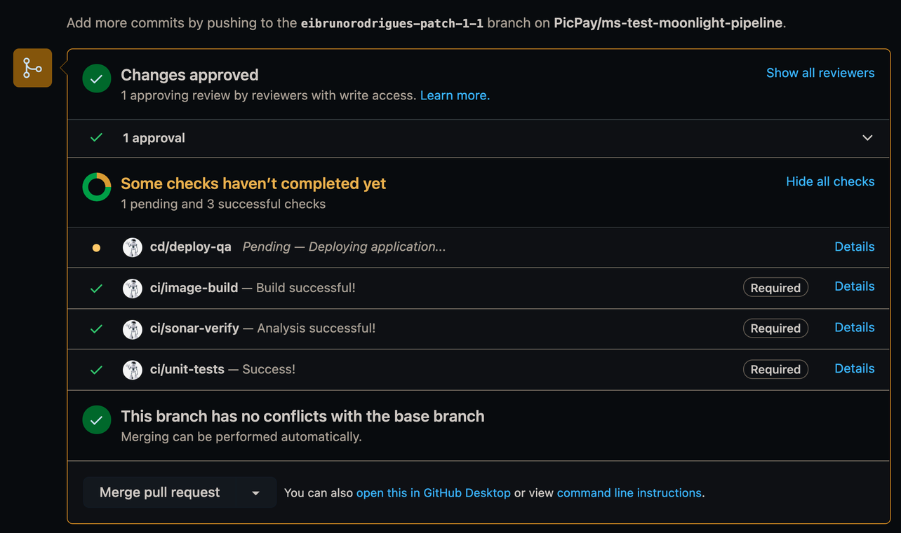
